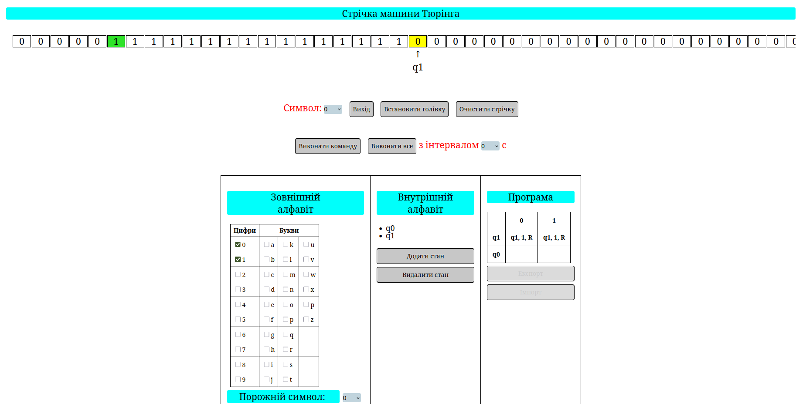

# Turing Machine Simulator

A simple, browser‑based implementation of a deterministic Turing machine.
Designed for education, experimentation, and demonstrations of computability
concepts.

---

## 🔍 Overview



This project provides a minimal Turing machine simulator written in
**HTML, CSS, and JavaScript**. It allows users to define states, transitions,
and tape contents, then step through executions to observe how the machine
processes input.

The core files are:

- `index.html` – UI and structure
- `script.js` – simulation logic
- `style.css` – basic styling

---

## ⚙️ Features

- Define machine states and transition rules
- Load a custom tape alphabet and input
- Step‑through execution or run to completion
- Visual representation of tape head movement and state changes
- Simple, extensible codebase suitable for learning or integration

---

## 🚀 Getting Started

### Prerequisites

No build tools or external dependencies are required – just a modern web browser.

### Running Locally

1. Clone or download the repository:
   ```bash
   git clone https://github.com/yourusername/turing-machine.git
   cd turing-machine
   ```

2. Open `index.html` in your browser (double‑click or use an HTTP server).

   *Tip:* You can serve the folder with Python:
   ```bash
   python3 -m http.server 8000
   ```
   then visit `http://localhost:8000` in your browser.

---

## 📘 Usage

1. Enter the set of states and specify the start/accept/reject states.
2. Add transition rules using the UI.
3. Input the initial tape contents.
4. Click **Step** to advance one transition, or **Run** to execute fully.
5. Observe the tape and current state displayed on screen.

---

## 🛠️ Development

Feel free to adapt or extend the simulator:

- Add support for non‑deterministic machines
- Improve the user interface with frameworks or animations
- Export/import machine definitions

Contributions via pull requests are welcome. Please follow standard
[GitHub contribution guidelines](https://github.com/yourusername/yourrepo/blob/main/CONTRIBUTING.md)
if you add one.

---

## 📄 License

This project is released under the **MIT License** – see [LICENSE](LICENSE.txt) for
details.

---

> 🎓 Designed as an educational tool, the Turing Machine Simulator aims to help
> students and hobbyists visualise the mechanics of computation.
